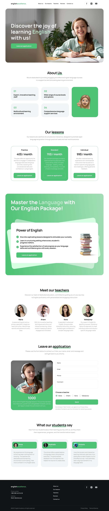
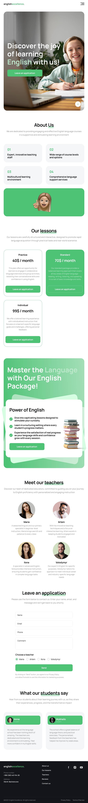
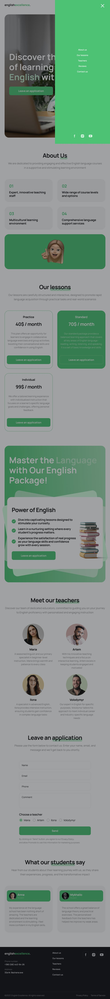
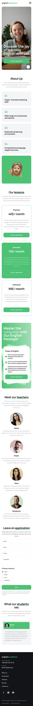
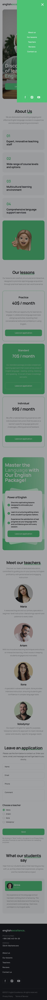

# English excellence (односторінковий сайт)

**Базові задачі**

- Верстка адаптивна, окрім мобільних пристроїв. Точки перелому:
  - mobile: верстка гумова від 320px, стає адаптивною з 375px;
  - tablet: з 768px;
  - desktop: з 1280px;
- Верстка валідна (https://validator.w3.org/ , https://jigsaw.w3.org/css-validator/);
- Забезпечити дотримання семантики відповідно до стандартів HTML5;
- Здійснити підключення шрифтів;
- Забезпечити оптимізацію розмірів векторної та растрової графіки;
- Забезпечити підтримку відображення картинок для retina-екранів;
- Оптимізувати завантаження зображень;
- Всі svg-іконки підключити через sprite;
- Додати відображення фавікон сторінки;

**Макет сторінки**

  - desktop

  

  - tablet

  

  

  - mobile

  

  

